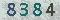
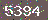
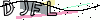
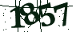

# captcha-break
captcha break based on opencv2, tesseract-ocr and some machine learning algorithm.

## Types
### Basic[[python](./basic/python)]
  
The simplest captcha breaking.

### CSDN[[python](./csdn/python)]
  
CAPTCHA from http://download.csdn.net/

### Weibo.cn[[python](./weibo.cn/python)]
  
CAPTCHA from http://login.weibo.cn/login/.  
(Note: This website has changed now, and the captcha is not available!)

### JiKeXueYuan[[python](./jikexueyuan/python)]
   
CAPTCHA of http://passport.jikexueyuan.com/sso/verify

